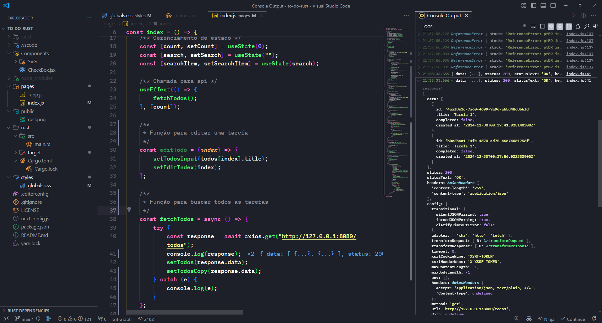

<h1 align="center">
    PROJETO RUST e NEXT JS • TO-DO-RUST
</h1>

## Crie um aplicativo de lista de tarefas full-stack com Rust Backend e Next.js Frontend | Projeto Ferrugem

Crie um aplicativo de lista de tarefas full-stack com Rust Backend e Next.js Frontend | Rust Project

Neste projeto nós vamos construir um aplicativo de lista de tarefas full-stack do zero usando Rust para o backend e Next.js para o frontend.

O que você aprenderá:

-   Configurando um backend Rust com Actix-web
-   Implementando operações de banco de dados usando Diesel ORM
-   Criando APIs RESTful em Rust
-   Construindo um frontend moderno com Next.js e React
-   Buscando dados do backend usando React Query
-   Gerenciando o estado do aplicativo e a IU com Next.js

# Imagem do Projeto



# Configuração inicial

## Instalar Vs Editor de Código

```https://code.visualstudio.com/download
  GET: VsCode Editor
```

## INSTALAR NODE

```https://nodejs.org/en/download
   https://nodejs.org/en/download
```

## INSTALAR RUST

```https://doc.rust-lang.org/book/
  RUST DOC: https://doc.rust-lang.org/book/

  Instalar no MACOS/Linux
  RUST: curl --proto '=https' --tlsv1.2 -sSf https://sh.rustup.rs | sh

  Instalar no Windows
  https://www.rust-lang.org/tools/install

  Verificar versão instalada
  rustc --version
```

## Estrutura do projeto

```https://doc.rust-lang.org/book/
  to-do-list
      ├── Cargo.toml
      └── src
          └── main.rs
```

## COMANDO DE BUILD E EXECUÇÃO (BACKEND)

```https://doc.rust-lang.org/book/
   COMANDO:  cargo run
```

## COMANDO FRONTEND

```https://doc.rust-lang.org/book/
   COMANDO:  npx run
```

## INSTALAR EXTENSÃO

```https://doc.rust-lang.org/book/
   COMANDO:  rust-analyzer
```

## PACOTES

```https://doc.rust-lang.org/book/
    [package]
      name = "todo-backend"
      version = "0.1.0"
      edition = "2018"

      [dependencies]
      actix-web = "4"
      actix-cors = "0.6"
      serde = { version = "1.0", features = ["derive"] }
      uuid = { version = "1.0", features = ["serde", "v4"] }
      chrono = { version = "0.4", features = ["serde"] }
```

## Clonar o projeto

```https://github.com/SilvaneiMartins/to-to-rust
   GIT CLONE: https://github.com/SilvaneiMartins/to-to-rust
```

## Instrução de código final

Se você baixar o código-fonte final, poderá seguir as seguintes instruções para executar o projeto com sucesso.

## Contribuindo 💡

Contribuições são bem-vindas! Sinta-se à vontade para abrir uma issue ou enviar um pull request.

## Licença 📝

Este projeto é licenciado sob [CC0 1.0 Universal]. Consulte o arquivo [LICENSE](https://github.com/SilvaneiMartins/to-to-rust/blob/master/LICENSE) para obter detalhes.

## Contato 📩

<a href="https://github.com/SilvaneiMartins">
    
    <br />
    <sub>
        <b>Silvanei de Almeida Martins</b>
    </sub>
</a>
     <a href="https://github.com/SilvaneiMartins" title="Silvanei martins" >
 </a>
<br />
🚀 Feito com ❤️ por Silvanei Martins
